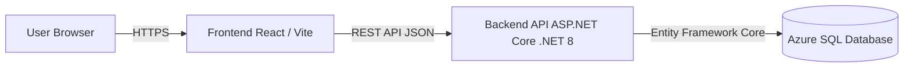

# System Architecture

## Overview

The Albanian Quora system follows a classic three-tier architecture:

- **Frontend (Presentation Layer)**
- **Backend API (Application Layer)**
- **Database (Data Layer)**

---

## Architecture Diagram

